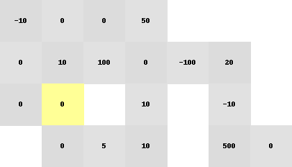

simple gridworld renderer
can render a sequence of moves on the gridworld as a gif

to use in a notebook:

    import IPython.display as IPdisplay
    output = '/tmp/output.gif'
    IPdisplay.Image(url=output)
